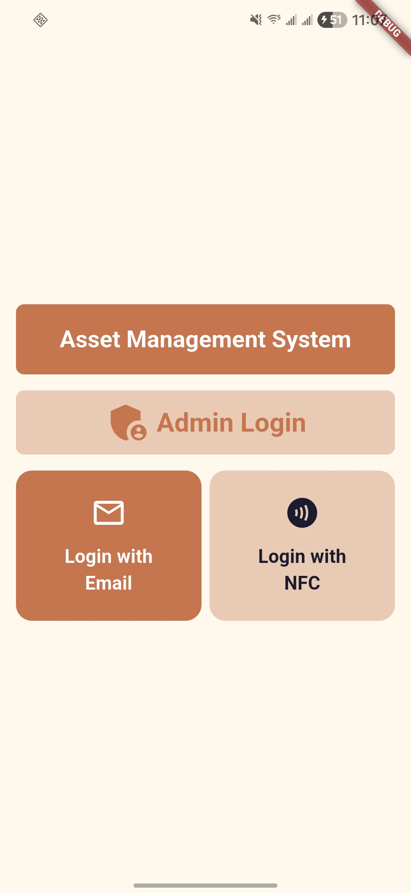
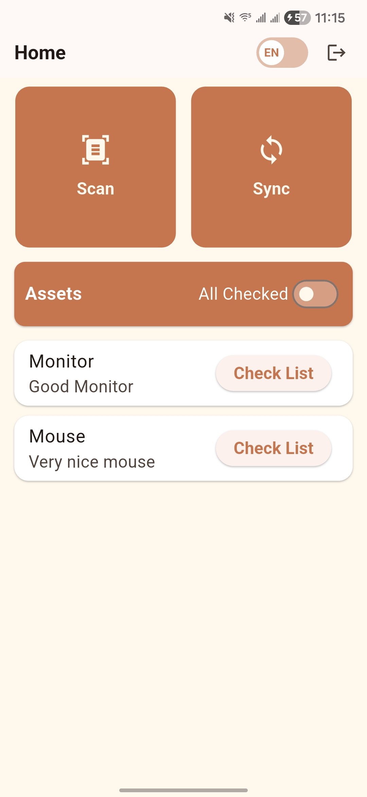
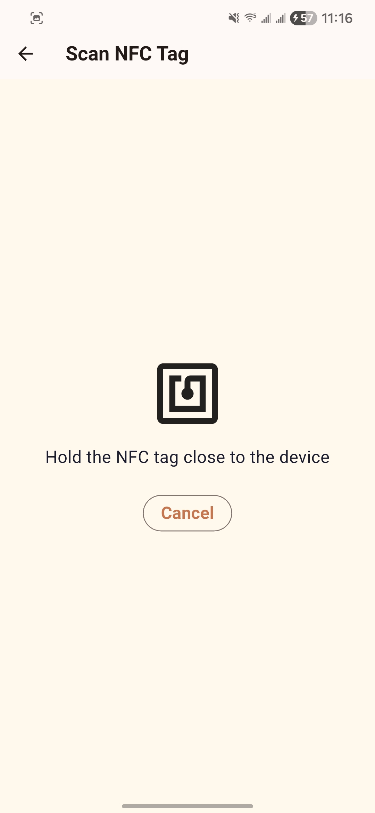
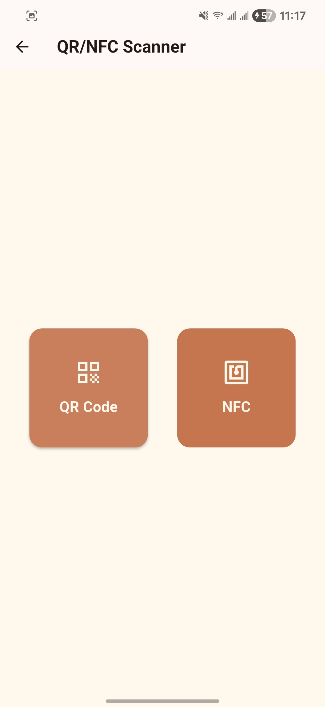
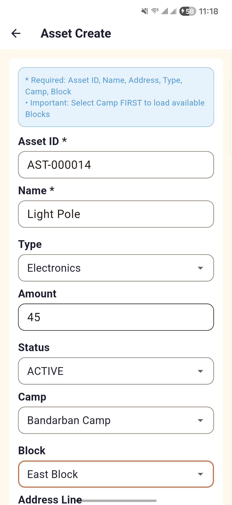
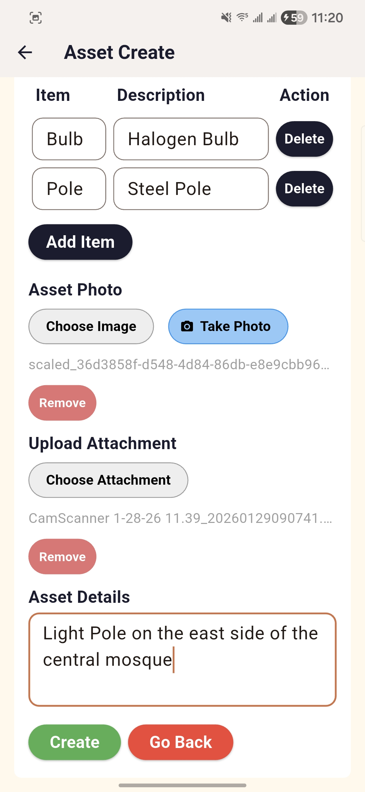
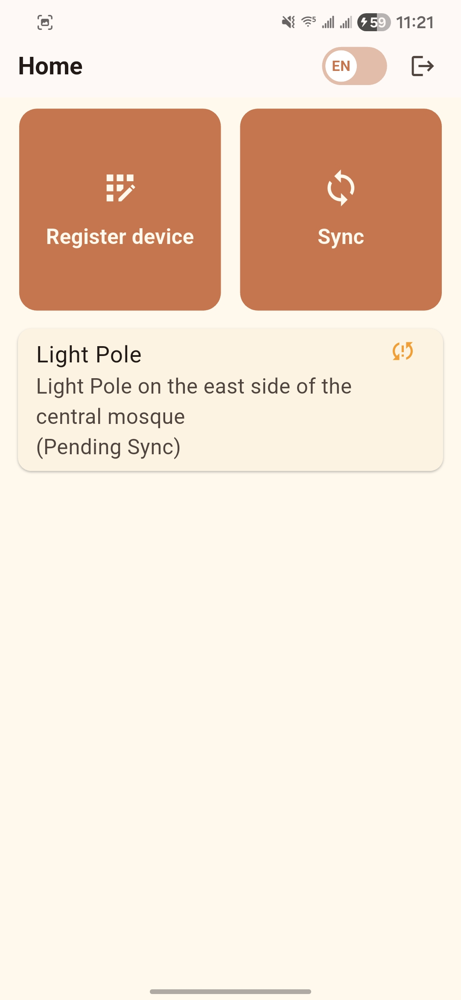
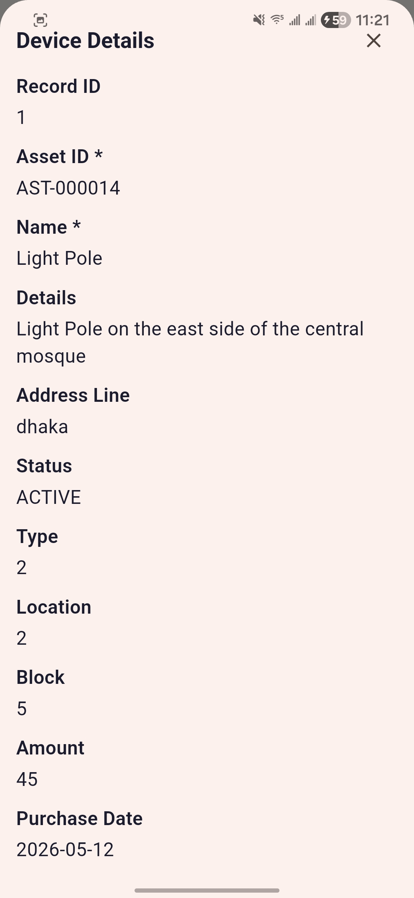
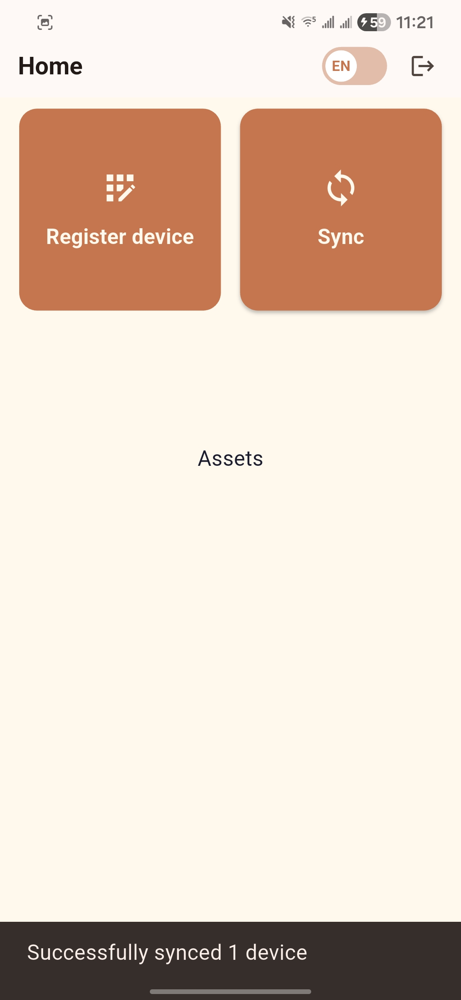

# Asset Management System (AMS)


A Flutter-based mobile app for tracking physical assets, verifying them on-site, and completing maintenance/inspection checklists with fast QR/NFC identification.

## What This Project Does

The Asset Management System helps field teams and operations staff manage assets from one app:

- Scan an asset using **QR** or **NFC**.
- Open the asset profile with relevant details and current status.
- Run and submit checklist tasks for inspection/maintenance.
- Continue working with cached/local data when connectivity is limited.
- Keep sensitive data protected with secure local storage.

## Core Features

- **Multi-modal asset lookup** with `mobile_scanner` and `nfc_manager`.
- **Asset profiles and status tracking** for day-to-day operations.
- **Checklist-driven workflows** for verification and maintenance.
- **Offline-friendly behavior** using `sqflite` local storage and caching.
- **Secure token/session handling** with `flutter_secure_storage`.
- **Riverpod architecture** for scalable state management.
- **Localization support**, including Bengali.

## Tech Stack

- **Framework**: [Flutter](https://flutter.dev)
- **State management**: [Riverpod](https://riverpod.dev)
- **Database/cache**: [sqflite](https://pub.dev/packages/sqflite)
- **Scanning**: [mobile_scanner](https://pub.dev/packages/mobile_scanner), [nfc_manager](https://pub.dev/packages/nfc_manager)
- **Secure/local storage**: [flutter_secure_storage](https://pub.dev/packages/flutter_secure_storage), [shared_preferences](https://pub.dev/packages/shared_preferences)
- **Networking**: [http](https://pub.dev/packages/http)

## Project Structure

```text
lib/
├── app/          # App-level bootstrapping and routes
├── components/   # Reusable UI components
├── core/         # Shared utilities, constants, and base services
├── data/         # Models, repositories, and data sources
├── l10n/         # Localization resources
├── pages/        # Feature screens/pages
├── providers/    # Riverpod providers and state wiring
├── theme/        # Theme and style configuration
└── main.dart     # Application entry point
```

## Getting Started

### Prerequisites

- Flutter SDK
- Dart SDK

### Setup

1. Install dependencies:

   ```bash
   flutter pub get
   ```

2. Run with API base URL:

   ```bash
   flutter run --dart-define=API_BASE_URL=https://api-ams.bitflex.xyz
   ```

3. Build release APK:

   ```bash
   flutter build apk --release --dart-define=API_BASE_URL=https://your-api-url.com
   ```

## Demo Flow

Use this flow to quickly understand how a typical user interacts with AMS:

1. **Sign in** and open the dashboard.
2. **Identify an asset** by scanning QR or NFC.
3. **Review asset details** including status and context.
4. **Start checklist tasks** and complete required checks.
5. **Submit updates** and continue with the next assigned asset.

## Screenshots

### Login, Dashboard, and Navigation





### Asset and Checklist Workflow





### Additional Screens





## License

This project is licensed under the [MIT License](LICENSE).
