# Asset Management System (AMS)


A Flutter-based mobile app for tracking physical assets, scanning tags (QR or RFID), registering devices, and completing on-site maintenance/checklist workflows with offline-first sync.

## What This Project Does

The Asset Management System helps field teams and operations staff manage assets from one app:

- Sign in as **Volunteer** (email/QR) or **Admin**.
- Scan assets using **QR** or **RFID** hardware flow.
- Register new devices and keep unsynced records locally until upload.
- Open asset profile details and update checklist responses in the field.
- Sync checklist/device updates when network becomes available.

## Core Features

- **Role-based app flows** for volunteer and admin users.
- **QR and RFID scanning** support through native scanner integration.
- **Device registration workflow** with offline queue + later sync.
- **Checklist-driven maintenance workflows** with partial/failure sync feedback.
- **Offline-first local persistence** using `sqflite` cache/storage.
- **Secure token/session handling** with `flutter_secure_storage`.
- **Riverpod architecture** for scalable state management.
- **Localization support** for English and Bengali.

## Tech Stack

- **Framework**: [Flutter](https://flutter.dev)
- **State management**: [Riverpod](https://riverpod.dev)
- **Database/cache**: [sqflite](https://pub.dev/packages/sqflite)
- **Scanning/input**: Native hardware scanner channel, [image_picker](https://pub.dev/packages/image_picker), [file_picker](https://pub.dev/packages/file_picker)
- **Secure/local storage**: [flutter_secure_storage](https://pub.dev/packages/flutter_secure_storage), [shared_preferences](https://pub.dev/packages/shared_preferences)
- **Networking**: [http](https://pub.dev/packages/http)

## Project Structure

```text
lib/
├── app/          # App-level bootstrapping and routes
├── components/   # Reusable UI components
├── core/         # Shared utilities, constants, and base services
├── data/         # Models, repositories, and data sources
├── l10n/         # Localization resources
├── pages/        # Feature screens/pages
├── providers/    # Riverpod providers and state wiring
├── theme/        # Theme and style configuration
└── main.dart     # Application entry point
```

## Getting Started

### Prerequisites

- Flutter SDK
- Dart SDK

### Setup

1. Install dependencies:

   ```bash
   flutter pub get
   ```

2. Run with API base URL:

   ```bash
   flutter run --dart-define=API_BASE_URL=https://api-ams.bitflex.xyz
   ```

3. Build release APK:

   ```bash
   flutter build apk --release --dart-define=API_BASE_URL=https://your-api-url.com
   ```

## Demo Flow

Use this flow to quickly understand how a typical user interacts with AMS:

1. **Authenticate** as volunteer (email/QR) or admin.
2. **Scan or register** devices using QR/RFID.
3. **Review asset details** and current status.
4. **Complete checklist tasks** and fill parameter/remarks fields.
5. **Sync queued updates** (checklists/devices) when online.

## Screenshots

### Authentication

<p>
  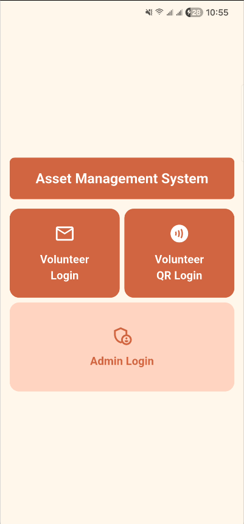
  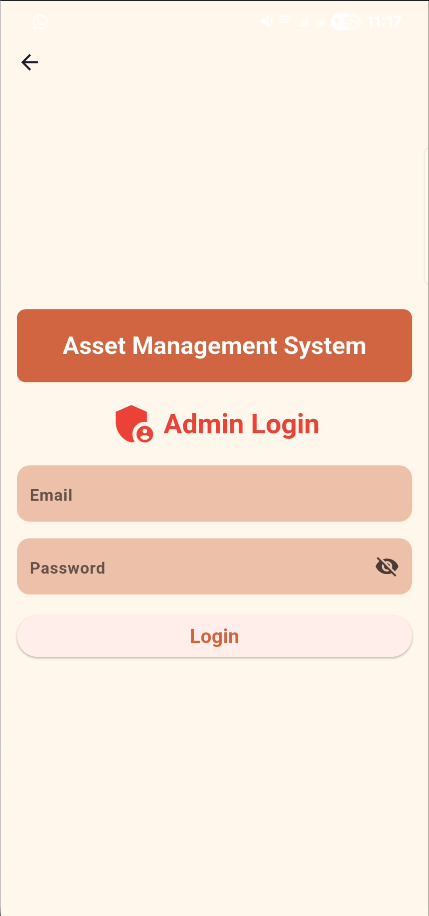
</p>

### Home and Asset List

<p>
  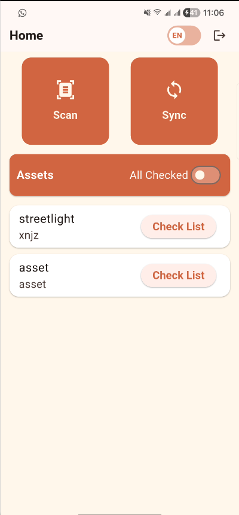
  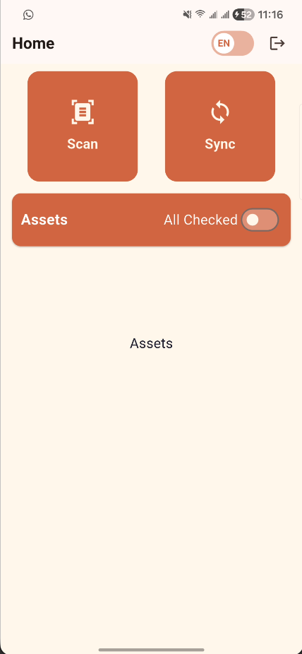
  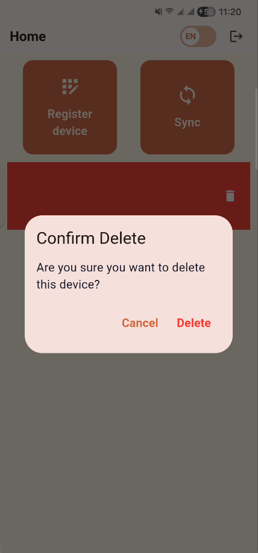
  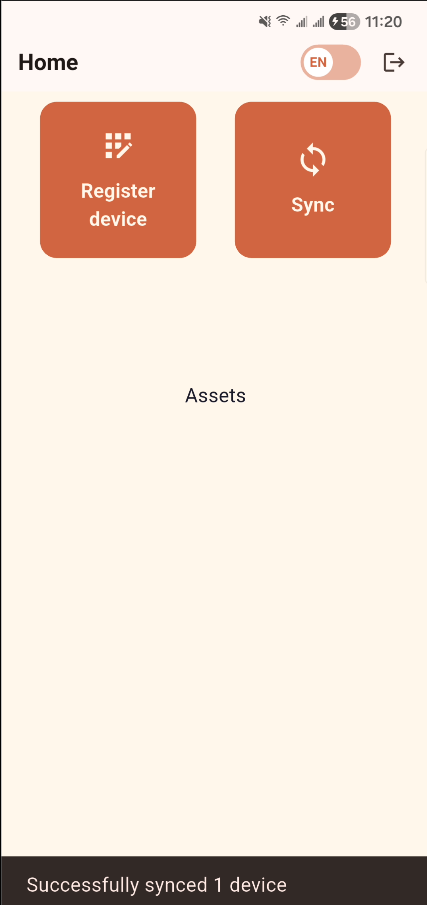
</p>

### Scan and Register Device

<p>
  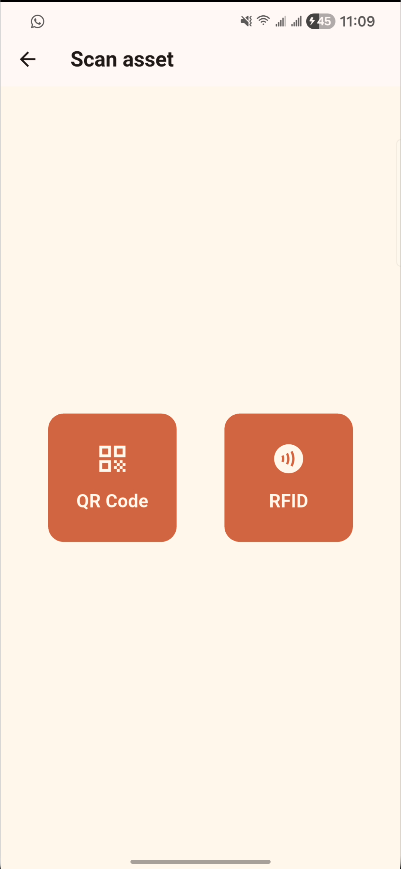
  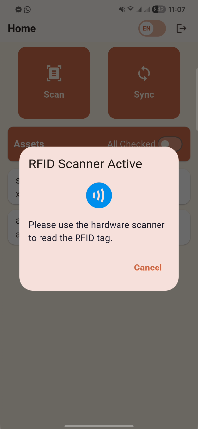
  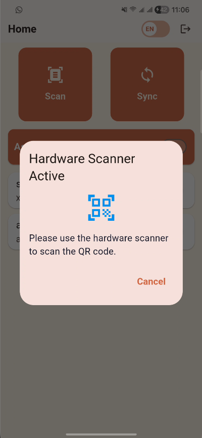
  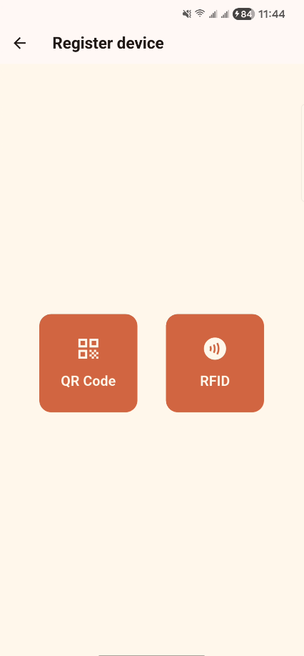
</p>

<p>
  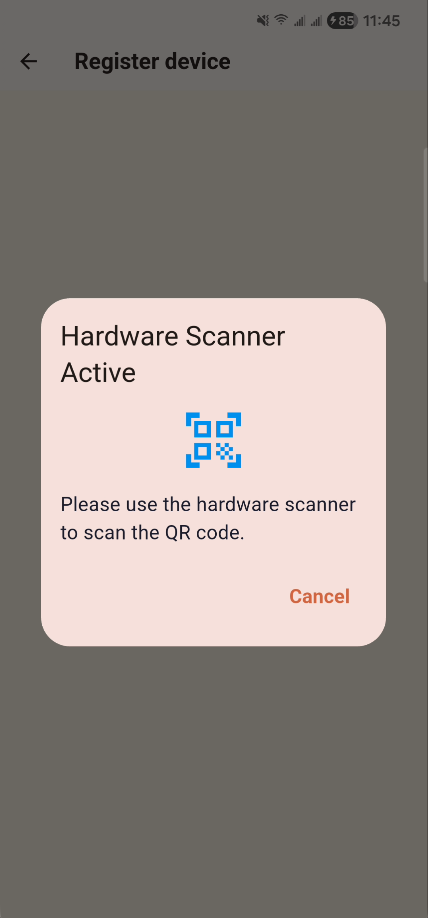
  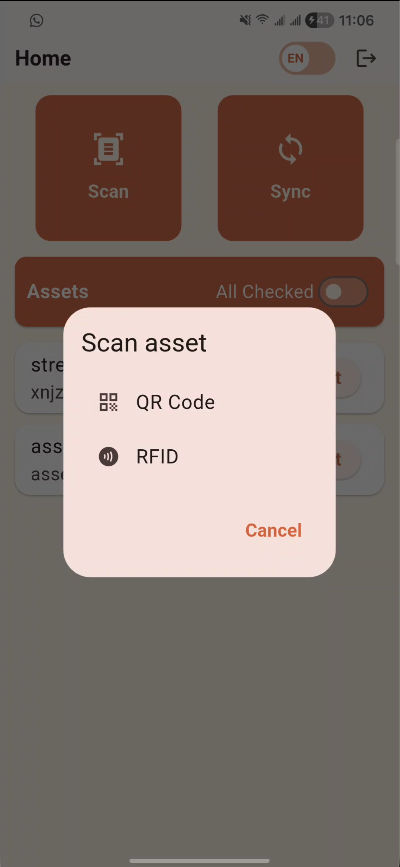
</p>

### Asset Creation

<p>
  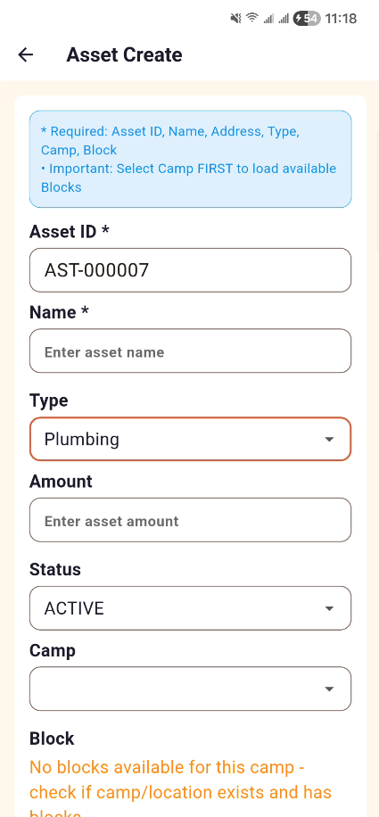
  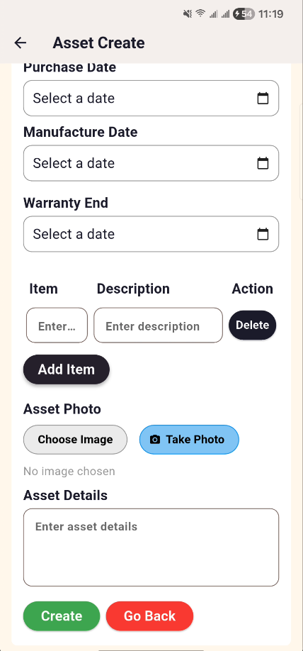
</p>

### Asset Details and Checklist

<p>
  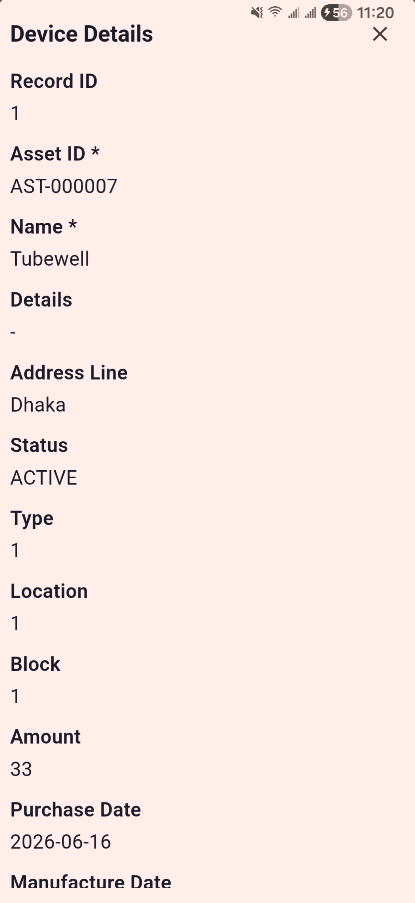
  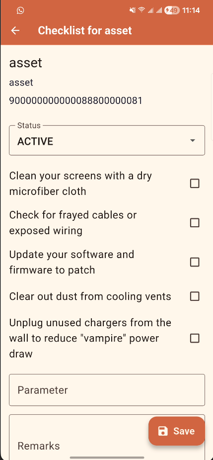
  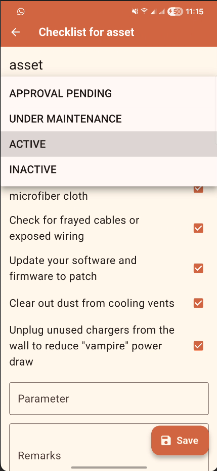
  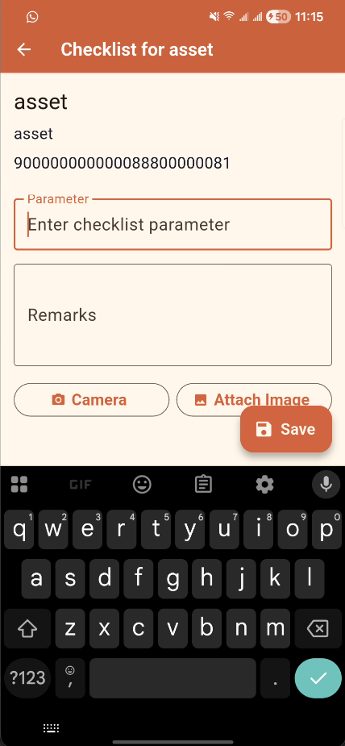
</p>

### Sync and Device Actions

<p>
  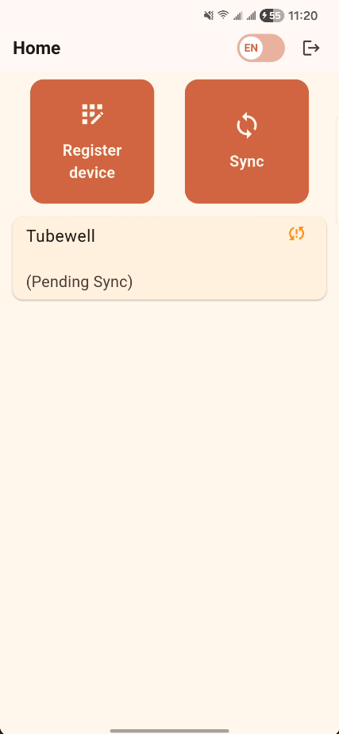
  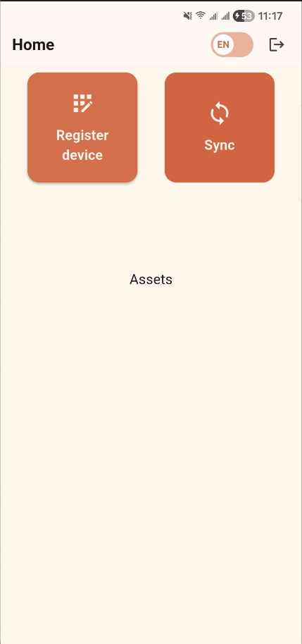
</p>

## License

This project is licensed under the [MIT License](LICENSE).
