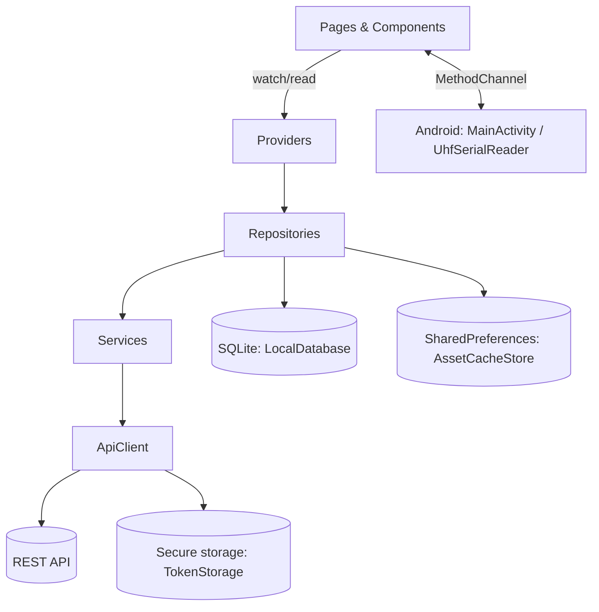

# Asset Monitoring System (AMS) — Technical Documentation

Version `2.0.0+1` · Flutter / Dart `^3.11.4` · Android package `com.catchbangladesh.ams`

This document describes how the codebase works. For a quick-start and screenshots see the root `README.md`.

## Contents

1. [Overview](#1-overview) · 2. [Tech stack](#2-tech-stack) · 3. [Project layout](#3-project-layout) · 4. [Architecture](#4-architecture)
5. [Authentication & session](#5-authentication--session) · 6. [Backend API](#6-backend-api) · 7. [Hardware scanning](#7-hardware-scanning-dart--android-bridge)
8. [Data layer & offline strategy](#8-data-layer--offline-strategy) · 9. [Providers reference](#9-providers-reference) · 10. [Screens & user flows](#10-screens--user-flows)
11. [Localization](#11-localization) · 12. [Theming](#12-theming) · 13. [Logging & errors](#13-logging--error-handling) · 14. [Android specifics](#14-android-specifics)
15. [Build, run, test](#15-build-run-test) · 16. [Known quirks](#16-known-quirks-and-pitfalls) · 17. [How to extend](#17-how-to-extend) · 18. [Troubleshooting](#18-troubleshooting) · 19. [Glossary](#19-glossary)

---

## 1. Overview

AMS is an Android-first Flutter app for field teams that manage physical assets (e.g. in camps/blocks). It targets **rugged handheld PDAs** with a built-in hardware barcode scanner and a UHF RFID reader, not phone cameras.

Two roles exist:

| Role | How they sign in | What they do |
|------|------------------|--------------|
| **Volunteer** | Email + password, or scan their volunteer QR code | See assigned assets, scan an asset (QR or RFID), complete and submit its checklist |
| **Admin** | Email + password via the Admin screen (opened from login) | See all assets, register new assets (QR/RFID tag → form), sync locally-saved registrations to the server |

Key behaviours:

- **Offline-first.** Assets and checklists are cached in SQLite; checklist submissions made offline are queued and synced later; new asset registrations are stored locally until the admin taps Sync.
- **Hardware scanning.** QR/barcode via OEM broadcast intents; RFID via a native serial UHF reader. Both are bridged to Dart through a single `MethodChannel`.
- **Bilingual UI.** English and Bengali (`bn`), toggleable at runtime.
- **Daily auto-logout.** Volunteer sessions are cleared at 23:59 local time.

---

## 2. Tech stack

| Concern | Library |
|---------|---------|
| State management / DI | `flutter_riverpod` 3.x (`Notifier`, `FutureProvider`) |
| HTTP | `http` |
| Secure storage (tokens, session) | `flutter_secure_storage` |
| Structured local DB | `sqflite` |
| Key-value cache | `shared_preferences` |
| Image / file selection | `image_picker`, `file_picker` |
| Localization | `flutter_localizations`, ARB files + `flutter gen-l10n` |
| Splash | `flutter_native_splash` |

> Note: `README.md` lists `mobile_scanner`, but it is **not** a dependency in `pubspec.yaml`. Scanning is done by the PDA hardware (see §7).

---

## 3. Project layout

```
lib/
├── main.dart                 # Entry: error handlers + ProviderScope
├── app/app.dart              # MaterialApp, theme, locale, auth-based home switch
├── core/
│   ├── config/app_config.dart        # API base URL (--dart-define)
│   ├── network/{api_client,endpoints}.dart
│   ├── storage/{token_storage,local_database,asset_cache_store}.dart
│   ├── utils/{ast_id_parser,volunteer_id_parser,network_error_utils}.dart
│   ├── logging/{app_log,riverpod_observer}.dart
│   ├── providers.dart                # tokenStorage, apiClient, localDatabase, assetCacheStore
│   └── uhf_service.dart              # Dart side of the RFID bridge
├── data/
│   ├── models/               # LoginResponse, VolunteerAsset, AssetChecklist(Item), IdNamePair
│   ├── services/             # AuthService, AssetService (raw API calls)
│   └── repositories/         # AuthRepository, AssetRepository (cache, queue, sync)
├── providers/                # auth, asset, locale, qr_scanner (ScannerService)
├── pages/                    # Screens
├── components/               # Reusable widgets (home/, asset_create/, asset_checklist/)
├── theme/                    # colors, text styles, padding, gap, radius
└── l10n/                     # app_en.arb, app_bn.arb + generated localizations
android/app/src/main/
├── kotlin/com/catchbangladesh/ams/
│   ├── MainActivity.kt               # MethodChannel + scan broadcast receiver
│   ├── UhfSerialReader.kt            # UHF reader driver / frame parser
│   └── DeviceAdminReceiver.kt        # Device-admin callbacks (logging only)
├── java/com/gg/reader/…, com/gxwl/…, com/pda/…   # Vendor UHF SDK sources
└── jniLibs/                          # Vendor native serial-port libs (4 ABIs)
test/                         # widget_test, network_error_utils_test, volunteer_id_parser_test
```

---

## 4. Architecture

A layered architecture, wired together with Riverpod providers:



The same layering as plain text:

```
 Pages / Components  ──watch──▶  Providers  ──▶  Repositories  ──▶  Services  ──▶  ApiClient ──▶ REST API
                                                      │
                                                      ├──▶ LocalDatabase (SQLite)
                                                      └──▶ AssetCacheStore (SharedPreferences)
```

- **Services** (`data/services`) – thin, stateless HTTP wrappers that parse JSON and throw `Exception` on failure.
- **Repositories** (`data/repositories`) – own the offline logic: cache fallbacks, queues, retry, verification.
- **Providers** (`providers/`, `core/providers.dart`) – expose repositories and async data to the UI.
- **Pages/Components** – UI only; call providers and `HomeScreenActions` helpers.

### App bootstrap (`main.dart`, `app/app.dart`)

1. `runZonedGuarded` plus `FlutterError.onError` and `PlatformDispatcher.onError` route every uncaught error to `AppLog.error`.
2. `ProviderScope` is created with `AppProviderObserver` (logs provider updates in debug and failures always).
3. `App` watches `scannerServiceProvider` (this registers the MethodChannel handler at startup), `authProvider`, and `localeProvider`.
4. `home` is chosen from `AuthStatus`:

| `AuthStatus` | Screen |
|--------------|--------|
| `loading` | `SplashScreen` |
| `authenticatedVolunteer` | `HomeScreen()` |
| `authenticatedAdmin` | `HomeScreen(isAdmin: true)` |
| `unauthenticated` | `LoginScreen` |

There is no named-route table; navigation uses `Navigator.push(MaterialPageRoute)`.

---

## 5. Authentication & session

**Files:** `providers/auth_provider.dart`, `data/repositories/auth_repository.dart`, `data/services/auth_service.dart`, `core/storage/token_storage.dart`

- `AuthNotifier.build()` returns `loading` and schedules `checkLogin()`, which waits for both a stored-token check **and** a minimum 2 s splash, then reads the stored role.
- Three login paths, each hitting a different endpoint (`Endpoints`): `login` (volunteer email/password), `adminLogin`, `qrLogin` (posts `volunteer_id`).
- On success `AuthRepository._persistLogin`:
  1. Validates access + refresh tokens are non-empty.
  2. Saves tokens and role (`volunteer` / `admin`) in secure storage.
  3. Derives a **session/cache key** (user email → username → typed identifier → timestamp fallback) and stores it. This key namespaces all cached data per user.
  4. Calls `AssetRepository.prefetchOfflineData` (best-effort; login still succeeds if it fails).
- `logout()` clears secure storage and that user's local DB rows, then invalidates all session-scoped providers (some are keyed only by `astId`, so stale data would otherwise leak between users).
- **Auto-logout:** for volunteers only, a 30 s periodic timer checks for `23:59`; at that time it calls `LocalDatabase.clearAll()` and logs out. Note this wipes *all* local data including un-synced queues.
- The login screen reports errors through `authFailureMessage` (no-internet vs. API message vs. generic invalid-credentials).

### Token refresh (`ApiClient`)

Every request takes `auth: true/false`. On a `401` with `auth: true`, the client POSTs the refresh token to `/api/authentication/token/refresh`, stores the new access token, and **retries the request once**. A failed refresh clears secure storage. The default timeout is 20 s. `postFormDataWithFile` handles multipart uploads (rebuilds the request on retry because multipart requests can't be re-sent).

---

## 6. Backend API

Base URL: `AppConfig.apiBaseUrl` = `--dart-define=API_BASE_URL=…`, default `https://api-ams.bitflex.xyz`.

| Constant | Path | Used for |
|----------|------|----------|
| `login` | `POST /api/authentication/token` | Volunteer login |
| `adminLogin` | `POST /api/authentication/admin/token` | Admin login |
| `volunteerQrLogin` | `POST /api/authentication/qr/login/volunteer` | Volunteer QR login |
| `refresh` | `POST /api/authentication/token/refresh` | Token refresh |
| `myAsset` | `GET /api/volunteer/my-asset` | Volunteer's assigned assets |
| `adminAsset` | `GET /api/admin/assets` | All assets (admin) |
| `assetChecklistByAssetBase` | `GET /api/asset/responses/by-asset/{astId}` | Checklist + status/remark/parameter/image |
| `assetChecklistSubmit` | `POST /api/asset/responses/submit` | Submit checklist |
| `assetCreate` | `POST /api/asset/create/by-QR` (multipart) | Create asset |
| `campLocations` | `GET /api/location/camp-location` | Camp lookup |
| `blocksByCamp(id)` | `GET /api/location/block/read/camp/{id}` | Blocks for a camp |
| `assetTypes` | `GET /api/asset/type/list` | Asset type lookup |

Response envelope: successful bodies are `{ "code": 200, "data": … }`. Services treat both a non-200 HTTP status and a non-200 body `code` as failure for submit/create.

---

## 7. Hardware scanning (Dart ⇄ Android bridge)

Everything shares one channel: **`com.catchbangladesh.ams/scanner`**.

### Dart → native methods

| Method | Native behaviour |
|--------|------------------|
| `startHardwareScan` | Debounced (500 ms); sends broadcast `com.java.scan.open` to trigger the PDA scan engine |
| `stopHardwareScan` | Sends `com.java.scan.close`, resets debounce |
| `isUhfAvailable` | Currently always returns `true` |
| `startUhfInventory` / `stopUhfInventory` | Start/stop `UhfSerialReader` |

### Native → Dart callbacks

| Method | Payload |
|--------|---------|
| `onScanReceived` | Barcode string from a broadcast intent |
| `onUhfTag` | EPC hex string of a read RFID tag |

`MainActivity` registers a `BroadcastReceiver` for several OEM scan actions (`scan.rcv.message`, `orgaiot.intent.action.scan`, `com.kte.scan.result`, `com.android.scanner.service_settings`) and extracts the payload from the first non-blank extra among `barcodeData`, `data`, `barcode`, `SCAN_RESULT`, `scannerdata`. To support a new device, add its action/extra key to those lists.

### Dart side

- **`ScannerService`** (`providers/qr_scanner_provider.dart`) owns the **only** `setMethodCallHandler` for the channel. It writes barcodes into `scannerResultProvider` and forwards `onUhfTag` to `UhfService.handleNativeTag`. (`UhfService` deliberately does not register its own handler.)
- **`qrScannerLauncherProvider`** – stops UHF + scanner, clears the last result, shows `_HardwareScanDialog`, which wakes the scanner and pops with the scanned string.
- **`rfidScannerLauncherProvider`** – if UHF is available, pushes `UhfScannerScreen` and returns the first tag; otherwise (or on error) falls back to the hardware-scan dialog.
- `HomeScreenActions.showScanOptions` lets the user choose QR or RFID.

### `UhfSerialReader.kt`

Opens the vendor serial port via `SerialPortJNI` (powered by `PowerUtil`), waits up to 1.5 s for a base-version ack, sends an inventory-start message, then reads on a single-thread executor, reassembles frames from a buffer and extracts an EPC with several fallback parsers (`epcFromGxLengthByte`, `epcFromEmbedded90`, …). Duplicate EPCs are suppressed by time (`lastEmittedEpc` / `lastEmittedAtMs`) and tags are posted to the main thread. The vendor SDK under `java/com/gg/…`, `com/gxwl/…` and `jniLibs/` is third-party code — avoid editing it.

### ID normalisation (`core/utils`)

| Function | Input → Output |
|----------|----------------|
| `normalizeAstId` | Plain text or JSON (`ast_ID`/`ast_id`/`astId`) → asset ID |
| `normalizeRfidEpcAsAstId` | Strips whitespace, uppercases, and removes sign-extension artefacts (`FFFFFF90` → `90`) so the EPC is used as the asset ID |
| `normalizeVolunteerId` | URL query (`volunteer_id`), JSON (incl. nested `volunteer_data`), or plain → volunteer ID |

---

## 8. Data layer & offline strategy

### Models (`data/models`)

- `VolunteerAsset { name, details, astId }` — has `fromAssignmentJson` (API) and `fromCacheJson`.
- `AssetChecklistItem { featureId, title, response }` and `AssetChecklist { items, status='ACTIVE', remark, parameter, image }`.
- `IdNamePair { id, name }` for camps, blocks, asset types.
- `LoginResponse` / `UserObject` — tolerant of both `access_token`/`access` style keys and a nested `data` envelope.

### Storage (four stores)

| Store | Backed by | Holds |
|-------|-----------|-------|
| `TokenStorage` | `flutter_secure_storage` | access/refresh tokens, session key, session role |
| `LocalDatabase` | SQLite (db version 1) | see tables below |
| `AssetCacheStore` | `shared_preferences` | JSON caches for assets, checklists, camps, blocks, asset types (keys sanitised and prefixed per user) |
| In-memory | `AssetRepository` | `_cachedAssets` for 5 minutes to avoid rapid refetches |

**SQLite tables** (`core/storage/local_database.dart`):

| Table | Purpose |
|-------|---------|
| toggles queue | Queued per-feature toggles (`user_key, ast_id, feature_id, target_state, created_at`) |
| checklist submissions queue | `user_key, ast_id, payload_json, created_at, synced_at, retry_count, last_error, next_retry_at` |
| assets | Cached assigned assets per user |
| checklist | Cached checklist items per user + asset |
| registered devices | Locally registered assets awaiting upload: all create-asset fields, `image_path`, `asset_attachment`, `created_at`, `synced` flag |

### `AssetRepository` behaviour

- **`fetchMyAssets`** – in-memory cache (5 min) → API (persisted to DB) → on any failure, DB fallback; rethrows only if nothing cached.
- **`fetchChecklistByAssetId`** – API with cache fallback, then `_applyPendingSubmission` overlays the latest queued submission so the UI shows the user's pending answers while offline.
- **Lookups** (`fetchCampLocations`, `fetchBlocks`, `fetchAssetTypes`) – API with `AssetCacheStore` fallback.
- **`prefetchOfflineData`** – on login: volunteers pre-cache assets and every checklist; admins pre-cache camps, asset types and blocks per camp.
- **`queueChecklistSubmission`** – the path the UI actually uses: serialises the checklist (`ast_ID`, status, remark, parameter, image, local `image_path`, items) to JSON and inserts it in the submissions queue. Nothing is sent to the server at save time.
- **`syncQueuedResponses`** – run when the volunteer taps **Sync** on Home. Sends only the **latest queued payload per asset**, uploads the local image first if present, **verifies** the server echo (`_isSyncVerified`: status, remark, and every feature response must match), marks successes as synced, records `last_error` for failures, and returns a `ToggleSyncResult(totalPending, synced, failed)`.
- **`submitChecklist`** – a direct "upload now, queue on failure" variant. It is **not called by any screen** at present (only the queue + sync path is used).
- **Asset registration** – `saveRegisteredDeviceLocally` inserts into the registered-devices table; `syncRegisteredDevice(id)` uploads it (multipart image/attachment only if the files still exist), retries once without `block` if the backend answers "Data not found", then verifies the returned asset against what was sent and marks it synced. Status is intentionally not strictly verified because the backend workflow may override it (e.g. to "APPROVAL PENDING").
- Image handling for checklists: `_resolveChecklistImageForUpload` converts a local image path to an upload payload (with MIME detection) when needed.

---

## 9. Providers reference

| Provider | Type | Purpose |
|----------|------|---------|
| `authProvider` | `NotifierProvider<AuthNotifier, AuthStatus>` | Session state machine |
| `localeProvider` | `NotifierProvider<LocaleNotifier, Locale>` | Defaults to device language if `bn`, else `en`; `toggleLanguage()` |
| `scannerServiceProvider` / `scannerResultProvider` | Provider / Notifier | Hardware scan plumbing |
| `qrScannerLauncherProvider`, `rfidScannerLauncherProvider` | Provider of launcher functions | Show scan UI, return scanned string |
| `myAssetsProvider`, `adminAssetsProvider` | `FutureProvider` | Asset lists |
| `assetChecklistProvider(astId)` | `FutureProvider.family` | A single asset's checklist |
| `assetChecklistAllTrueProvider(astId)` | `FutureProvider.family<bool>` | True if checklist is non-empty and all items are `true` |
| `assetAllTrueStatesProvider` | `FutureProvider<Map<String,bool>>` | Prefetches all-true state for every asset, **4 at a time** |
| `homeBootstrapProvider` / `adminHomeBootstrapProvider` | `FutureProvider<void>` | What the pull-to-refresh awaits |
| `showAllTrueAssetsProvider` | Notifier<bool> | Home filter toggle |
| `filteredAssetsProvider` | derived `Provider` | Assets whose all-true state equals the filter; unknown state counts as not-complete |
| `campLocationsProvider`, `blocksProvider(campId)`, `assetTypesProvider` | `FutureProvider` | Create-asset form lookups |
| `unsyncedRegisteredDevicesProvider`, `registeredDeviceProvider(id)` | `FutureProvider` | Admin's pending local registrations |

Several providers deliberately use `ref.read(x.future)` rather than `watch` to avoid Riverpod pause-count assertion errors when providers are invalidated from the UI (see comments in `asset_provider.dart`).

---

## 10. Screens & user flows

| Screen (`pages/`) | Description |
|-------------------|-------------|
| `splash_screen` | Shown while `AuthStatus.loading` (min 2 s) |
| `login_screen` | QR login button, expandable email/password form, link to `AdminScreen`, language toggle |
| `admin_screen` | Admin email/password form; pops on success |
| `home_screen` | Asset list with pagination (10 per page, infinite scroll), pull-to-refresh, filter card, action buttons, sync, logout |
| `asset_checklist_screen` | Toggle checklist items, enter remark/parameter, pick status, attach image (camera/gallery), save to queue |
| `register_device_screen` | Admin: scan QR or RFID, then continue to creation |
| `asset_create_screen` | Admin: full asset form (name, details, address, type, camp → block, status, dates, amount, dynamic specification rows, image, attachment) |
| `uhf_scanner_screen` | Listens to `UhfService.tagStream`, returns first tag |
| `qr_scanner_screen` | "Verify asset" screen opened from an asset card: QR/RFID buttons, opens the checklist only on matching ID |

### Volunteer flow

1. Log in (email/password or QR) → assets and checklists are prefetched.
2. Home lists assigned assets; filter toggles between incomplete and fully-checked assets.
3. Tap **Scan** → choose QR/RFID → scan → the scanned ID must match one of the user's assets (else a mismatch snackbar) → `AssetChecklistScreen`.
4. **Save** always writes the checklist to the local queue (even when online) and returns to Home. The checklist screen then shows the pending answers via `_applyPendingSubmission`.
5. Tap **Sync** on Home → `syncQueuedResponses` uploads the latest payload per asset, verifies the response, then refreshes checklist providers. The snackbar reports `synced / total` and any failures.

Tapping an asset *card* takes a second route: `QrScannerScreen(asset)` asks the user to scan QR or RFID for **that specific asset** and only opens its checklist when the scanned ID matches.

### Admin flow

1. Admin login → home shows all assets plus locally registered, un-synced devices.
2. **Register device** → scan QR or RFID tag (for RFID, the EPC becomes the asset ID) → `AssetCreateScreen` with the scanned ID pre-filled. (If `RegisterDeviceScreen` is opened for an existing asset card, the scanned ID must match that asset and the screen simply returns it.)
3. The form requires: asset ID, name, address, **asset type, camp and block**. Optional: details, status, amount, purchase/manufacture/warranty dates, dynamic specification rows (name + description), image (camera or file). Submitting stores a registration locally (`registered devices` table) — nothing is uploaded yet.
4. Tapping **Sync** uploads each pending device one by one; failures are flagged on the cards (`_failedDeviceIds`) and the API error (with the `ast_ID` extracted from messages like `ast_ID = 'X' has already been assigned…`) is shown. If network is lost mid-way the loop aborts with the no-internet message.

---

## 11. Localization

- `l10n.yaml`: ARBs in `lib/l10n`, template `app_en.arb`, output `app_localizations.dart`. Currently 138 keys each in `app_en.arb` and `app_bn.arb`.
- Add a string: add the key to **both** ARB files, then run `flutter gen-l10n` (or `flutter pub get`, since `generate: true`).
- Access with `AppLocalizations.of(context)!`. Parameterised messages (e.g. `deviceSyncSuccess(count)`) are generated as methods.

## 12. Theming

`lib/theme/` centralises design tokens: `ThemeColor`, `ThemeTextStyles`, padding, gap and border-radius constants. `App` builds a Material `ThemeData` from the seed colour, with `FadeUpwards` transitions on Android.

## 13. Logging & error handling

- `AppLog.info/warn/error` wraps `dart:developer.log` (levels 800/900/1000); in release mode only errors are emitted.
- `network_error_utils.dart`: `isNoInternetError`, `offlineAwareErrorMessage`, `syncFailureMessage` (strips nested `Exception:` and sync-layer prefixes), `authFailureMessage`.

---

## 14. Android specifics

- **Permissions:** `INTERNET`, `CAMERA`, `BIND_DEVICE_ADMIN`.
- **Device admin:** `AssetManagementDeviceAdminReceiver` is declared with `@xml/device_admin_policy`; its callbacks only log.
- **`MainActivity`** – `launchMode=singleTop`; registers the scan receiver with `RECEIVER_EXPORTED` on API 33+.
- `fix_scanner.sh` is a debugging helper that runs `adb logcat | grep -i scanner`.

---

## 15. Build, run, test

```bash
flutter pub get
flutter gen-l10n                                   # if ARB files changed
flutter run --dart-define=API_BASE_URL=https://api-ams.bitflex.xyz
flutter build apk --release --dart-define=API_BASE_URL=https://your-api-url.com
flutter test
flutter analyze
```

Hardware scanning and RFID only work on a supported PDA; on a regular phone the scan dialogs will wait indefinitely for a broadcast.

### Tests (`test/`)

- `widget_test.dart` — login flow, home list (pagination, pull-to-refresh, scan match/mismatch), admin home, QR screen, and repository tests (cache fallback, in-memory cache clearing, pending toggles, latest-payload-per-asset sync). Uses fake `AssetService` / `LocalDatabase` subclasses.
- `volunteer_id_parser_test.dart` — URL/JSON/nested/plain ID parsing.
- `network_error_utils_test.dart` — `syncFailureMessage` unwrapping.

No tests cover `ApiClient` token refresh, `AuthRepository`, `asset create` sync, or the native Kotlin code.

---

## 16. Known quirks and pitfalls

These are observations from reading the code, not necessarily bugs to fix:

1. **README mismatch:** `mobile_scanner` is documented but not used.
2. **Daily wipe:** the 23:59 auto-logout calls `clearAll()`, deleting unsynced queued checklist submissions and registered devices.
3. **`isUhfAvailable` always `true`** on the native side, so the "fall back to hardware dialog" path only triggers if opening the reader throws on the Dart side.
4. **Typos in identifiers:** `getUnyncedRegisteredDevices` (in `LocalDatabase`), local variable `unaycdDevices` in `home_screen.dart`.
5. **Queued toggles table** exists and has enqueue/load/remove methods, but the active offline path uses the *checklist submission* queue.
6. **Sync verification** reads the response key `remakk` (as returned by the backend) with fallback to `remark`.
7. **Save never talks to the server:** the checklist screen always queues; the user must press Sync on Home. Unsynced data is lost on the 23:59 wipe or on logout (logout clears that user's rows).
10. **Dead code:** `AssetRepository.submitChecklist`, and `LocalDatabase.enqueueToggles/loadPendingToggles/removeQueuedToggles`, are not used by the UI.
11. **Attachment never captured:** the registered-devices table and sync code support an `asset_attachment` file, but `AssetCreateScreen` never passes one to `saveRegisteredDeviceLocally`.
12. **Pending overlay is partial:** `_applyPendingSubmission` restores item answers, status and remark but not `parameter` or `image`.
8. **Cache key is the email**, so two accounts with the same identifier share cached data.
9. **Hard-coded default API URL** points at a production-looking host; always pass `API_BASE_URL` for non-prod builds.

---

## 17. How to extend

**Add a screen** – create `lib/pages/foo_screen.dart` (`ConsumerWidget`/`ConsumerStatefulWidget`), reach it with `Navigator.push(MaterialPageRoute(...))`, add strings to both ARB files.

**Add an API call** – (1) constant in `Endpoints`; (2) method in `AssetService`/`AuthService` that calls `ApiClient` with `auth: true` and throws on non-200; (3) wrap it in `AssetRepository` if it needs caching/queueing; (4) expose it via a `FutureProvider` in `providers/asset_provider.dart`; (5) if data is user-specific, add the provider to `_invalidateSessionScopedProviders` in `auth_provider.dart`.

**Support a new scanner model** – add its broadcast action to `scanActions` and its extra key to `scanDataKeys` in `MainActivity.kt`; use `fix_scanner.sh` (`adb logcat | grep -i scanner`) to discover them.

**Change the database schema** – edit `_createTables` **and** bump `version` with an `onUpgrade` migration in `LocalDatabase._openDatabase` (currently only `onCreate`, version 1, so existing installs won't pick up new columns otherwise).

**Add a language** – add `app_xx.arb`, add the locale to `supportedLocales` in `app.dart`, and update `LocaleNotifier` (today it toggles only between `en` and `bn`).

---

## 18. Troubleshooting

| Symptom | Likely cause / fix |
|---------|--------------------|
| Scan dialog never closes | Device isn't a supported PDA, or its broadcast action/extra key isn't in `MainActivity`. Check `adb logcat`. |
| RFID screen opens but no tags | Serial port/power failure in `UhfSerialReader.start()`; check logcat; ensure only one inventory is running. |
| "Mismatch" snackbar after scanning | Scanned ID differs from the asset's `ast_ID` after normalisation (QR JSON vs plain, or RFID EPC vs registered ID). |
| Login works but lists are empty offline | Prefetch is best-effort; log in once while online. |
| Checklist changes not on server | They are only queued; press Sync on Home. |
| Registration sync fails: "ast_ID … already assigned" | Duplicate asset ID on server; delete the local registration or use a different tag. |
| Sync fails: "response mismatch" | Server returned different values than sent (see `_isSyncVerified` / `_isAssetCreationVerified`). |
| Data gone after midnight | 23:59 auto-logout clears the local DB. Sync before then. |
| Wrong server | Pass `--dart-define=API_BASE_URL=…` at build time. |

---

## 19. Glossary

| Term | Meaning |
|------|---------|
| **AMS** | Short name of the app |
| **ast_ID / astId** | Unique asset identifier; the value encoded in a QR code, or the RFID tag's EPC |
| **EPC** | Electronic Product Code stored on a UHF RFID tag |
| **PDA** | Rugged handheld device with built-in scanner/RFID reader |
| **Feature / checklist item** | One yes/no inspection point on an asset (`feature_id`) |
| **Camp / Block** | Two-level location hierarchy; a block belongs to a camp |
| **Volunteer** | Field user assigned to assets |
| **Session key** | Per-user cache namespace (email/username) in secure storage |
| **Queue** | Locally stored submissions waiting for Sync |
